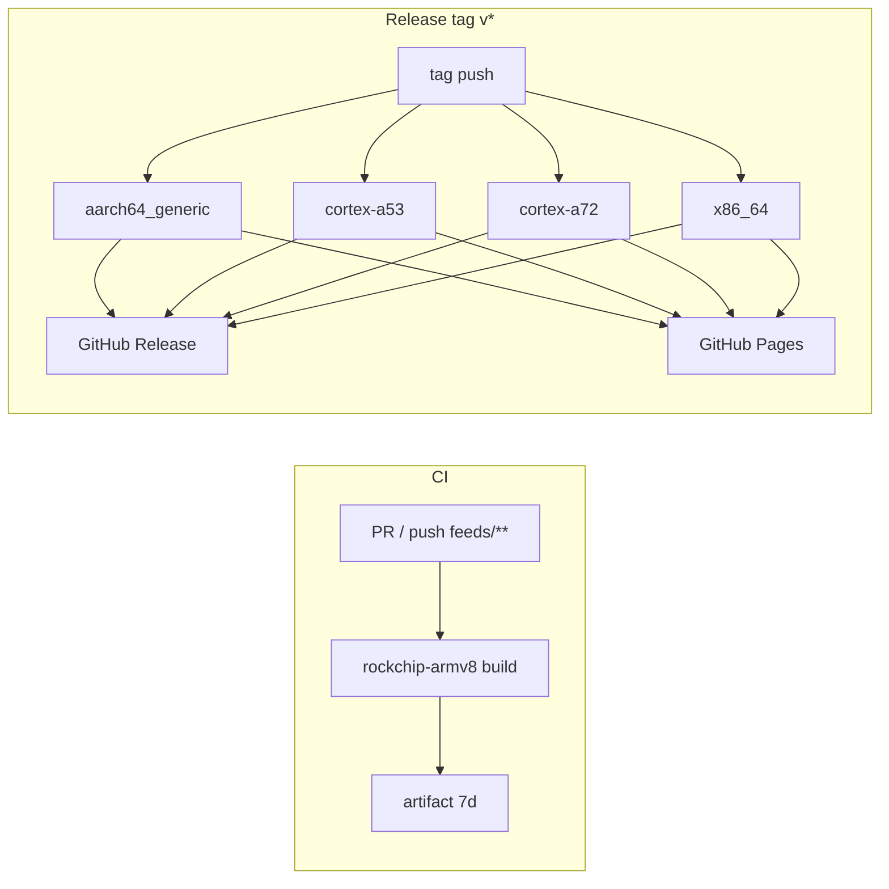

# GitHub Actions CI/CD — optimization report

*For [T-REX-XP/openwrt-packages](https://github.com/T-REX-XP/openwrt-packages). Last updated: 2026-06-19.*

This document records the initial pipeline review, gaps found, and the optimizations applied. It complements the original [CI plan](ci-github-actions-plan.md).

---

## Executive summary

The first CI/CD implementation was **functionally correct** (feed path, SDK action, release + Pages layout) but **not tuned** for GitHub Actions minutes, cancellation, or publish integrity.

After optimization:

| Metric | Before | After |
|--------|--------|-------|
| CI matrix (default) | 2 full SDK builds | **1** (`rockchip-armv8` / CM5) |
| CI on doc-only changes | Always runs | **Skipped** (`paths` filter) |
| Duplicate in-flight runs | Allowed | **Cancelled** (`concurrency`) |
| Release partial publish | Possible (`continue-on-error`) | **Blocked** (all arches must pass) |
| Artifacts per release arch | 2 (tarball + Pages tree) | **1** tarball |
| Shared build logic | Duplicated in 2 files | **Reusable workflow** |
| SDK action pin | `@master` | **Commit SHA** |
| Checkout depth (CI) | Full history | **Shallow** (`fetch-depth: 1`) |
| Package scope | All feed packages implicit | **Explicit `PACKAGES` list** |

---

## Architecture (after optimization)

```text
.github/workflows/
  build-packages.yml   ← reusable: SDK build + optional artifacts
  ci.yml               ← PR/push: 1 arch (+ optional x86 via dispatch)
  release.yml          ← tag v*: 4 arches → Release + Pages
  dependabot.yml       ← weekly action updates
```



---

## Caching strategy

OpenWrt/ImmortalWrt SDK builds run **inside Docker**. Most compile artifacts live in the container filesystem and are **not** visible to the host runner, so classic `actions/cache` on `dl/` or `build_dir/` does not apply without custom volume mounts.

### What is cached today

| Layer | Mechanism | Scope | Owner |
|-------|-----------|-------|-------|
| **SDK Docker image layers** | BuildKit `cache-from` / `cache-to` `type=gha` | Per `CONTAINER` + `ARCH` | [immortalwrt/gh-action-sdk](https://github.com/immortalwrt/gh-action-sdk) |
| **QEMU / Buildx setup** | Docker setup actions | Per runner job | gh-action-sdk |
| **Artifact upload** | `compression-level: 6` | Per artifact | Our workflows |

The SDK action cache key is effectively:

```text
scope = immortalwrt/sdk-<ARCH>
```

Examples: `immortalwrt/sdk-rockchip-armv8-24.10-SNAPSHOT`, `immortalwrt/sdk-x86_64-24.10-SNAPSHOT`.

**First run** for an architecture: slow (pull/build SDK image). **Subsequent runs** on the same arch: significantly faster layer reuse.

### What is not cached (and why)

| Candidate | Why skipped |
|-----------|-------------|
| Go module cache (`blocky`) | Downloads happen inside SDK container; path not on host workspace |
| OpenWrt `dl/` tarball cache | Same — inside container ephemeral FS |
| Host `~/.docker` | Redundant with BuildKit GHA cache for this action |
| Cross-job SDK reuse | Each matrix job is an isolated container run by design |

### Future caching options (if build times grow)

1. **Fork/patch gh-action-sdk** to bind-mount `dl/` and `ccache` to `/artifacts/.cache/` and add `actions/cache` on that directory keyed by `ARCH` + hash of `feeds/**/Makefile`.
2. **Self-hosted runner** with persistent SDK trees (heavy ops).
3. **Reduce matrix** further — drop `cortex-a53/a72` if no users need them (CM5 uses `aarch64_generic` from `rockchip-armv8` SDK).

---

## Optimizations implemented

### Tier 1 — reliability & cost control

| Change | File | Effect |
|--------|------|--------|
| `concurrency` + `cancel-in-progress` | `ci.yml`, `release.yml` | New pushes cancel stale runs |
| `timeout-minutes: 90/120` | `build-packages.yml` | Prevents 6h runaway jobs |
| `paths` filter (`feeds/**`, `.github/**`) | `ci.yml` | Skips SDK build for docs-only edits |
| Remove `continue-on-error` | `release.yml` | Release/Pages require all arches green |
| Pin SDK action SHA `c4848d7…` | `build-packages.yml` | Reproducible, safer builds |
| `fetch-depth: 1` | CI + release via reusable workflow | Faster checkout (`NO_REFRESH_CHECK` already true) |

### Tier 2 — faster CI

| Change | Effect |
|--------|--------|
| Default CI = **rockchip-armv8 only** | ~50% fewer CI minutes vs dual matrix |
| `workflow_dispatch` → `include_x86` | Optional second arch when needed |
| Explicit **`PACKAGES`** list | Builds only feed packages, not accidental extras |

### Tier 3 — leaner release

| Change | Effect |
|--------|--------|
| **One artifact** `feed-<arch>.tar.gz` per matrix job | Half the artifact upload/download |
| Pages job **extracts tarballs** | No duplicate `public/` artifact |
| **Reusable workflow** | Single place for SDK env/toggles |

### Maintenance

| Change | Effect |
|--------|--------|
| `.github/dependabot.yml` | Weekly grouped updates for Actions |

---

## SDK image tags

ImmortalWrt publishes **`24.10-SNAPSHOT`** tags on Docker Hub, not pinned **`24.10.5`**.

| Role | `ARCH` env |
|------|------------|
| CM5 / rockchip | `rockchip-armv8-24.10-SNAPSHOT` → packages in `aarch64_generic/` |
| Pi / cortex-a53 | `aarch64_cortex-a53-24.10-SNAPSHOT` |
| cortex-a72 SBCs | `aarch64_cortex-a72-24.10-SNAPSHOT` |
| x86 sanity / VM | `x86_64-24.10-SNAPSHOT` |

Verify tags: [immortalwrt/sdk tags](https://hub.docker.com/r/immortalwrt/sdk/tags?name=24.10-SNAPSHOT).

---

## Secrets & signing

Unchanged from the [CI plan](ci-github-actions-plan.md):

| Secret | Used in |
|--------|---------|
| `PRIVATE_KEY` | Release builds (`INDEX=1`, apk signing) |
| `PUBLIC_KEY` | Published as `public-key.pem` on Pages |
| `KEY_BUILD` / `KEY_BUILD_PUB` | Legacy ipk (optional) |

CI and PR builds remain **unsigned** (no secrets required).

---

## Operational notes

### Enable GitHub Pages

**Settings → Pages → Build and deployment → GitHub Actions**.

### Manual CI with x86

**Actions → CI → Run workflow** → enable **Also build x86_64**.

### Updating the pinned SDK action

When bumping [immortalwrt/gh-action-sdk](https://github.com/immortalwrt/gh-action-sdk):

1. Review upstream changelog.
2. Update the SHA in `.github/workflows/build-packages.yml`.
3. Run CI on a PR before merging.

Dependabot will propose updates to `actions/checkout`, `upload-artifact`, etc.; **review SDK action SHA bumps manually**.

---

## Remaining trade-offs

| Item | Decision |
|------|----------|
| PR + merge double CI | Accepted; `concurrency` limits waste on same branch |
| SNAPSHOT SDK drift | Accepted; ImmortalWrt does not ship `-24.10.5` Docker tags |
| 4-arch release matrix | Kept for feed consumers; highest minute cost |
| No host-side Go/`dl/` cache | Not feasible without SDK action changes |

---

## References

- [ci-github-actions-plan.md](ci-github-actions-plan.md) — original design
- [immortalwrt/gh-action-sdk](https://github.com/immortalwrt/gh-action-sdk)
- [GitHub Actions concurrency](https://docs.github.com/en/actions/using-jobs/using-concurrency)
- [GitHub Actions cache](https://docs.github.com/en/actions/using-workflows/caching-dependencies-to-speed-up-workflows)
- [Reusable workflows](https://docs.github.com/en/actions/using-workflows/reusing-workflows)
