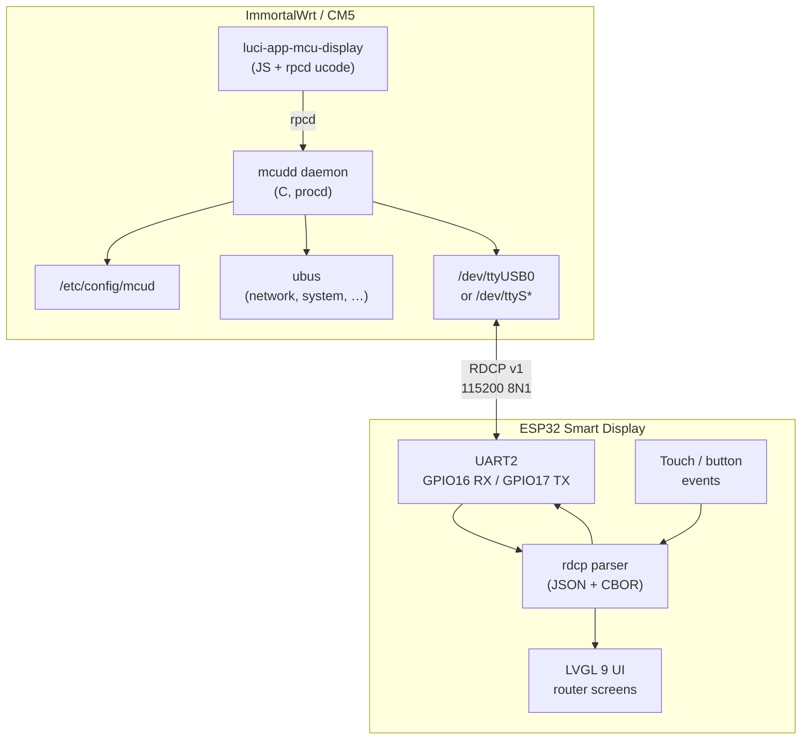
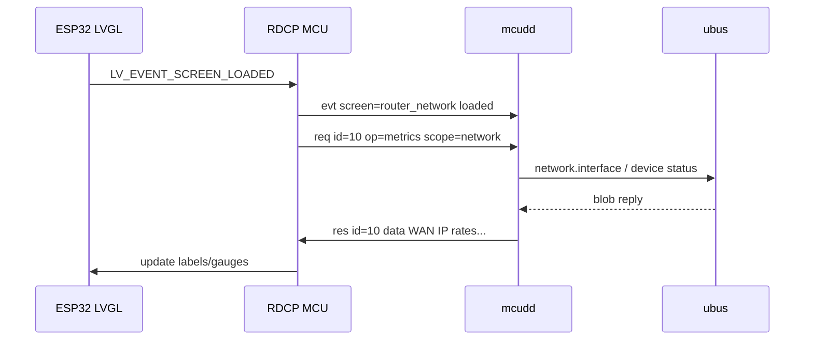
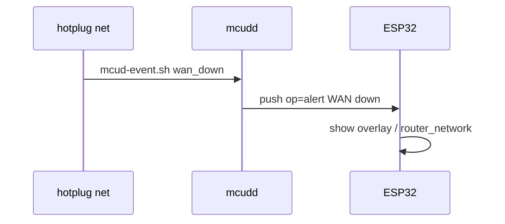
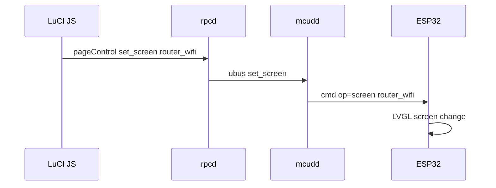

# luci-app-mcu-display — system design & implementation plan

External color LCD panel (ESP32 + LVGL) as a router status display, connected to Orange Pi CM5 / ImmortalWrt over UART. Uses the [esp32-smartdisplay-demo](https://github.com/rzeldent/esp32-smartdisplay-demo) firmware and UI as the MCU side, and [luci-app-oled](../feeds/luci/luci-app-oled/) as the OpenWrt integration reference.

**Related repos**

| Repo | Role |
|------|------|
| `esp32-smartdisplay-demo` | LVGL UI, MCU firmware, dev Python simulators |
| `openwrt-packages/feeds/luci/luci-app-oled` | Reference: daemon + ubus + LuCI + UCI patterns |
| `openwrt-packages/feeds/luci/luci-app-mcu-display` | **New** — UART bridge daemon, protocol, LuCI (not yet created) |

---

## 1. Executive summary

The CM5 already ships a **128×64 I²C OLED** (`luci-app-oled` / `oledd`). A separate **ESP32 smart display** (typically 240×320–800×480 RGB panel via `esp32-smartdisplay`, not LVDS) adds a rich touch UI for router monitoring. The router runs a C daemon on a serial port; the ESP32 runs LVGL and exchanges structured messages over UART.

**Goals**

1. Bidirectional UART protocol (MCU pull + host push + user-input events).
2. Production **C daemon** on OpenWrt (`mcudd`), not Python.
3. **LuCI app** (`luci-app-mcu-display`) for port config, service control, page mapping, diagnostics — mirroring `luci-app-oled` layout.
4. ESP32 firmware refactored for **dedicated UART** (not USB-CDC debug), router-centric screens, and protocol v1.

**Non-goals (v1)**

- Replacing or merging with `luci-app-oled` (different hardware, both may coexist).
- On-MCU WiFi configuration or LuCI rendering.
- NAS/portable-storage features from `NAS_TODO.md` (future phase).

---

## 2. Current state audit

### 2.1 ESP32 firmware (`esp32-smartdisplay-demo`)

| Area | Status | Notes |
|------|--------|-------|
| **Display stack** | Done | LVGL 9.2, EEZ Studio UI, `esp32-smartdisplay` RGB panels (CYD family). Default board: `esp32-2432S022C` (240×320). |
| **UI screens** | Demo only | Splash, Clock, Call (CPU gauge), Chat, Music, Weather, Alarm — consumer-gadget layout, not router pages. |
| **Serial transport** | Partial | `Serial` (USB CDC @ 115200) in `main.cpp`. `esp32_msgpack_example.ino` shows UART2 GPIO16/17 but is **not integrated**. |
| **Inbound parsing** | JSON only | `handleSerial()` uses `ArduinoJson`; **MessagePack responses are not parsed** despite Python defaulting to msgpack. |
| **Outbound commands** | Ad hoc JSON | `{"request":"cpu\|alarms\|storage"}`, `{"cmd":"POWEROFF"}`. Screen-specific timers in `ui_Call.cpp`, `ui_Alarm.cpp`. |
| **Screen notify (MCU→host)** | Missing | Host can push `{"screen":"Clock"}` but MCU never reports swipe/navigation to host. |
| **Router metrics** | Missing | CPU/storage from host; no WAN, WiFi clients, interfaces, security. |
| **Legacy menu** | Dead code | `main.cpp` menu_screen / swipe nav unused; EEZ UI is active. |
| **Reset handling** | Present | GPIO0 held HIGH, DTR/RTS disabled in simulators — good pattern for production UART. |

**Protocol today (implicit, undocumented)**

```
MCU  →  Host   newline-terminated JSON
        {"request":"cpu"}
        {"request":"alarms"}
        {"request":"storage"}
        {"cmd":"POWEROFF"}

Host →  MCU    newline-terminated JSON or MessagePack (simulator bug: msgpack method missing in esp32_simulator.py)
        {"cpu":"42","temp_c":"45.0","fs_free":"1024.0",...}
        {"alarms":[{"time":"08:00","label":"...","enabled":true},...]}
        {"storage":[{"device":"...","mountpoint":"/",...},...]}
        {"screen":"Clock"|"Weather"|"Alarm"|"Chat"|"Music"|"Splash"}
```

**Gaps**

- No protocol version, message IDs, errors, or checksums.
- Format mismatch: host may send msgpack, MCU only reads JSON.
- No subscription/push model for link-up, alerts, boot stage.
- No mapping between router `pages.json` concepts and LVGL screens.

### 2.2 Linux / dev host (`esp32-smartdisplay-demo`)

| Component | Status | Notes |
|-----------|--------|-------|
| `esp32_simulator.py` | Dev only | Python + pyserial + psutil; intended as systemd template. **`send_msgpack()` is called but not defined** — runtime error if `--format msgpack`. |
| `esp32_simulator_webui.py` | Dev only | Flask + SSE; msgpack send works; good protocol debugger. |
| `README_WEBUI.md` | Done | Documents dev workflow, not router deployment. |
| `NAS_TODO.md` | Planning | NAS-centric screens; mostly unchecked; informs long-term UI roadmap. |
| Production C daemon | **None** | Must be new `mcudd` in OpenWrt feed. |

### 2.3 OpenWrt reference (`luci-app-oled`)

| Component | Status | Reuse for mcu-display |
|-----------|--------|------------------------|
| `oledd` C daemon | Production | Pattern: main loop, ubus client, metrics collector, menu FSM. **Port I²C → UART.** |
| `oledd_data.c` | Production | ubus `system`, `network.*`, WiFi, `/sys` bandwidth — **extract/share as `router-metrics` or copy.** |
| `oledd_ubus_srv.c` | Production | `status`, `event`, `set_view` — **same API shape for `mcudd`.** |
| `oledd_input.c` | Production | FIFO + hotplug — **replace with UART event frames from ESP32.** |
| `pages.json` | Production | Declarative pages + tokens — **map to LVGL screen IDs + payload schema.** |
| `luci.oled.uc` + `oled.js` | Production | UCI, service control, status, preview — **clone structure to `luci.mcu-display.*`.** |
| Init / hotplug / preinit | Production | Boot state `/tmp/oled_state` — **reuse pattern as `/tmp/mcud_state` or shared.** |
| Hardware | CM5 I²C HAT | **Independent** — UART on USB-serial or `ttyS*` header. |

**Package ownership (no overlap)**

| Concern | Package | Path |
|---------|---------|------|
| SH1106 128×64 menu, GPIO buttons | `luci-app-oled` | Services → OLED |
| ESP32 color panel over UART | `luci-app-mcu-display` | Services → MCU Display |
| Fan, IR, I²C scan | `luci-app-peripherals` | System → Peripherals |

---

## 3. Target architecture



### 3.1 Layer responsibilities

| Layer | Responsibility |
|-------|----------------|
| **ESP32 firmware** | Render LVGL screens; send `req` / `evt` frames; apply `res` / `push` / `cmd` from host; rate-limit requests per screen. |
| **mcudd** | Open UART; frame encode/decode; collect router metrics (reuse `oledd_data` logic); push alerts and boot state; expose ubus API for LuCI/hotplug. |
| **rpcd ucode** | UCI get/set, `serviceControl`, `getStatus`, `getLogs`, `pageControl`, serial port enumeration. |
| **LuCI JS** | Single-page dashboard (status, connection, pages, service, logs) — follow `oled.js` + `luci-bootstrap-theming` skill. |

### 3.2 Physical connection (CM5)

| Option | Device node | CM5 J4 FPC | ESP32 side | Notes |
|--------|-------------|------------|------------|-------|
| **GPIO UART (production)** | `/dev/ttyS4` | Pad **6** TX (GPIO1_B3), pad **7** RX (GPIO1_B2), GND pad **7/8**, 3.3 V pad **1/2** | UART2 RX=16, TX=17 | **UART4 mux m2** — ImmortalWrt patch `9981-*-fpc-uart4`. Coexists with I2C7 OLED on pads 11/12. |
| USB-UART cable | `/dev/ttyUSB0` | — | UART0 USB-CDC (dev) or UART2 (prod) | Dev / bench only; not the CM5 shipped default. |
| Kernel debug UART | `/dev/ttyS2` | Module debug header (GPIO0_B5/B6) | — | **Do not use for mcudd** — `stdout-path` @ **1.5 Mbaud**. |

**Wiring (CM5 J4 → ESP32 UART2):**

| CM5 J4 pad | Signal | → | ESP32 |
|------------|--------|---|-------|
| 6 | UART4 TX (GPIO1_B3) | → | GPIO16 (RX) |
| 7 | UART4 RX (GPIO1_B2) | ← | GPIO17 (TX) |
| 7 or 8 | GND | ↔ | GND |
| 1 or 2 | 3.3 V | → | 3.3 V (optional if ESP32 self-powered) |

**Rejected alternative:** UART7 mux m2 on pads **9/10** (GPIO1_B4/B5) conflicts with **OLED RST** on pad 9.

**Production recommendation:** `/dev/ttyS4` @ **115200 8N1**, DTR/RTS disabled. USB CDC reserved for ESP32 development only.

---

## 4. RDCP v1 — Router Display Communication Protocol

**RDCP** replaces ad hoc JSON with versioned, typed, bidirectional frames. Line-delimited records (newline `0x0A`) for simplicity and alignment with current firmware.

### 4.1 Design principles

1. **MCU → host:** JSON UTF-8 (easy to generate on ESP32 with `ArduinoJson`).
2. **Host → MCU:** CBOR preferred (smaller than JSON); JSON accepted for debug.
3. Every frame has `"v":1` and `"t"` (type).
4. Request/response correlation via `"id"` (uint16, MCU monotonic).
5. Host may **push** without prior request (`"t":"push"`).
6. Max line length: **4096 bytes** (enforced both sides).

### 4.2 Frame types

| `t` | Direction | Purpose |
|-----|-----------|---------|
| `req` | MCU → host | Pull data: `op` = `metrics`, `page`, `boot`, `ping` |
| `res` | Host → MCU | Response to `req` (same `id`) |
| `push` | Host → MCU | Unsolicited update (metrics delta, alert, boot stage) |
| `evt` | MCU → host | User input, screen lifecycle |
| `cmd` | Host → MCU | Host-initiated UI action: `nav`, `screen`, `dim`, `splash` |
| `err` | Either | Error for `id`; `code` + `msg` |

### 4.3 Common fields

```json
{
  "v": 1,
  "t": "req",
  "id": 42,
  "op": "metrics",
  "scope": "system"
}
```

| Field | Type | Description |
|-------|------|-------------|
| `v` | int | Protocol version (=1) |
| `t` | string | Frame type |
| `id` | int | Correlation id (req/res/err) |
| `op` | string | Operation name |
| `scope` | string | Page/metrics scope (see §4.5) |
| `ts` | int | Optional host Unix time (push/res) |
| `data` | object | Payload |

### 4.4 MCU → host messages

**Request metrics (replaces `{"request":"cpu"}`)**

```json
{"v":1,"t":"req","id":1,"op":"metrics","scope":"system"}
{"v":1,"t":"req","id":2,"op":"metrics","scope":"network"}
{"v":1,"t":"req","id":3,"op":"metrics","scope":"storage"}
{"v":1,"t":"req","id":4,"op":"metrics","scope":"wifi"}
{"v":1,"t":"req","id":5,"op":"metrics","scope":"security"}
```

**Screen lifecycle event (new — enables host-side subscription)**

```json
{"v":1,"t":"evt","op":"screen","data":{"screen":"router_system","action":"loaded"}}
{"v":1,"t":"evt","op":"input","data":{"type":"gesture","dir":"left"}}
{"v":1,"t":"evt","op":"input","data":{"type":"button","name":"boot","duration_ms":120}}
```

**Legacy shim (transition period)**

`mcudd` accepts old `{"request":"cpu"}` and emits RDCP `res` internally so unmodified firmware works during Phase 1.

### 4.5 Host → MCU responses

**System scope** (maps from `oledd_data` tokens)

```json
{
  "v": 1,
  "t": "res",
  "id": 1,
  "data": {
    "hostname": "cm5-router",
    "uptime_short": "2d 04h",
    "cpu_load": 0.35,
    "cpu_temp": "48°C",
    "ram_pct": 0.62,
    "ram_used": "4.9G",
    "temp_short": "48°",
    "load_short": "0.35",
    "time": "18:42"
  }
}
```

**Network scope**

```json
{
  "v": 1,
  "t": "res",
  "id": 2,
  "data": {
    "wan_ip": "192.168.1.2",
    "rx_rate": "12.4M",
    "tx_rate": "1.2M",
    "ping_ms": 14,
    "link_wan": true,
    "link_lan": true
  }
}
```

**Push alert** (replaces implicit screen triggers)

```json
{
  "v": 1,
  "t": "push",
  "op": "alert",
  "data": {"level": "warn", "text": "WAN down", "screen": "router_network"}
}
```

**Navigation command**

```json
{"v":1,"t":"cmd","op":"screen","data":{"screen":"router_wifi"}}
{"v":1,"t":"cmd","op":"nav","data":{"dir":"next"}}
```

### 4.6 Screen ID mapping (router UI)

Map `pages.json` ids to LVGL router screens (new EEZ project or adapt existing):

| `pages.json` id | RDCP `screen` | LVGL module | Based on demo screen |
|-----------------|---------------|-------------|----------------------|
| `status` | `router_system` | `ui_Router_System` | Call (gauge) + status labels |
| `network` | `router_network` | `ui_Router_Network` | Weather (layout) |
| `clients` | `router_clients` | `ui_Router_Clients` | Chat (list) |
| `storage` | `router_storage` | `ui_Router_Storage` | Alarm (list) |
| `wifi` | `router_wifi` | `ui_Router_Wifi` | Music + QR |
| `security` | `router_security` | `ui_Router_Security` | Splash (icons) |
| — | `router_boot` | `ui_Router_Boot` | Splash animation |
| — | `router_alert` | overlay | modal on any screen |

Demo screens (Clock, Music, …) remain for **simulator/dev mode** when `mcud.@mcud[0].demo_mode=1`.

### 4.7 Timing & rate limits

| Parameter | Default | UCI option |
|-----------|---------|------------|
| Baud rate | 115200 | `baud` |
| Metrics poll (system) | 1000 ms | `interval_system` |
| Metrics poll (network) | 2000 ms | `interval_network` |
| Ping | 5000 ms | `interval_ping` |
| MCU max req rate | 10/s | enforced in `mcudd` |
| UART read timeout | 100 ms | internal |
| Push coalesce | 200 ms | internal (merge metrics pushes) |

### 4.8 Error codes

| `code` | Meaning |
|--------|---------|
| `parse` | Invalid JSON/CBOR |
| `version` | Unsupported `v` |
| `unknown_op` | Bad `op` |
| `busy` | Rate limited |
| `unavailable` | Metric source down (ubus timeout) |

---

## 5. Linux daemon — `mcudd`

### 5.1 Package layout (target)

```text
feeds/luci/luci-app-mcu-display/
├── Makefile
├── src/
│   ├── Makefile
│   └── mcudd/
│       ├── mcudd.c              # main, uloop, serial fd
│       ├── mcudd_serial.c       # termios, DTR/RTS, readline
│       ├── mcudd_rdcp.c         # encode/decode, legacy shim
│       ├── mcudd_metrics.c      # from oledd_data (+ pages tokens)
│       ├── mcudd_pages.c        # /etc/mcud/pages.json loader
│       ├── mcudd_push.c         # alert queue, boot stage
│       ├── mcudd_ubus.c         # client: system, network, wireless
│       ├── mcudd_ubus_srv.c     # server: status, event, set_screen
│       └── mcudd_config.c       # UCI
├── root/
│   ├── etc/
│   │   ├── config/mcud
│   │   ├── mcud/pages.json      # mirror oled pages → scope defs
│   │   ├── init.d/mcudd         # USE_PROCD=1, START=12
│   │   └── hotplug.d/net/99-mcud
│   └── usr/
│       ├── sbin/mcudd
│       ├── lib/mcud/mcud-event.sh
│       └── share/
│           ├── luci/menu.d/luci-app-mcu-display.json
│           └── rpcd/
│               ├── ucode/luci.mcu-display.uc
│               └── acl.d/luci-app-mcu-display.json
└── htdocs/luci-static/resources/
    ├── mcu-display-theme.css
    └── view/services/mcu-display.js
```

### 5.2 Module design

**`mcudd.c`**

- `uloop` + `ubus_connect`.
- Poll UART fd; on complete line → `mcudd_rdcp_handle_line()`.
- Periodic timer: refresh metrics for active scope (learned from last `evt` screen loaded).
- Register ubus object `mcudd` (same methods as `oledd` where applicable).

**`mcudd_serial.c`**

```c
int mcudd_serial_open(const char *dev, int baud);
int mcudd_serial_read_line(int fd, char *buf, size_t max);
int mcudd_serial_write_frame(int fd, const void *data, size_t len, enum mcudd_wire_format fmt);
```

- `termios`: 8N1, no hardware flow control, `CLOCAL`.
- `TIOCMGET` / `TIOCMSET`: clear DTR & RTS on open.
- Optional `flock` lock file `/var/run/mcudd.lock`.

**`mcudd_metrics.c`**

- Copy/adapt `oledd_data.c`, `oledd_net.c`, `oledd_wifi_ap.c`, `oledd_ubus.c`.
- Export `mcudd_metrics_for_scope(const char *scope, struct blob_buf *b)`.
- Long-term: shared static lib `librouter-metrics` used by `oledd` and `mcudd` (DRY refactor, post-v1).

**`mcudd_rdcp.c`**

- Parse MCU JSON → dispatch.
- Legacy adapter: `{"request":"cpu"}` → `metrics/system`.
- Build `res`/`push` frames; CBOR encode with `tinycbor` or `libcbor` (OpenWrt package).

**`mcudd_ubus_srv.c`**

| Method | Args | Description |
|--------|------|-------------|
| `status` | — | `{running, port, active_screen, link_ok, last_rx, last_tx, demo_mode}` |
| `event` | `{type}` | Inject nav events (LuCI debug); forward as `cmd` |
| `set_screen` | `{screen}` | Force screen change on MCU |
| `reload` | — | Reload `pages.json` |

### 5.3 Init script (`/etc/init.d/mcudd`)

Mirror `oledd`:

- `USE_PROCD=1`, `START=12` (after network `S20`, before most apps).
- `procd` respawn; `procd_add_reload_trigger mcud`.
- Wait for `$path` character device up to 15 s (USB enumerate).
- `procd_add_interface_trigger` → `mcud-event.sh` on `interface.*` up/down → push network alert.

### 5.4 UCI defaults (`/etc/config/mcud`)

```
config mcud 'main'
	option enable '0'
	option path '/dev/ttyUSB0'
	option baud '115200'
	option wire_format 'cbor'
	option demo_mode '0'
	option interval_system '1000'
	option interval_network '2000'
	option menu_timeout '30'
	option push_alerts '1'
	list scopes 'system'
	list scopes 'network'
	list scopes 'clients'
	list scopes 'storage'
	list scopes 'wifi'
	list scopes 'security'
```

### 5.5 Dependencies

```
LUCI_DEPENDS:=+luci-base +libubus +libubox +libblobmsg-json +libcbor +mcudd
```

Ship daemon inside same feed package initially (as `oledd` in `luci-app-oled`); split `mcudd` to `feeds/packages/mcudd` later if desired.

---

## 6. ESP32 firmware changes

### 6.1 New modules (PlatformIO)

```text
src/
├── rdcp/
│   ├── rdcp.h
│   ├── rdcp_parser.cpp      # line reader, JSON decode
│   └── rdcp_transport.cpp     # HardwareSerial UART2
├── router_ui/                 # new EEZ screens (or renamed demo)
│   └── screens/ui_Router_*.c
└── main.cpp                   # slim: setup, loop, delegate to rdcp + ui
```

### 6.2 Transport split

| Build flag | Transport | Use |
|------------|-----------|-----|
| `RDCP_TRANSPORT_USB` | `Serial` (CDC) | Development + web UI |
| `RDCP_TRANSPORT_UART2` | `Serial2` GPIO16/17 | Production on router |

`platformio.ini` environments:

- `esp32-2432S022C-rdcp-usb` — current behaviour + RDCP.
- `esp32-2432S022C-rdcp-uart` — production firmware.

### 6.3 Firmware tasks

| # | Task | Priority |
|---|------|----------|
| F1 | RDCP parser + CBOR inbound (libcbor or nano cbor) | P0 |
| F2 | Emit `evt` on `LV_EVENT_SCREEN_LOADED` / gesture | P0 |
| F3 | Router LVGL screens bound to metric scopes | P0 |
| F4 | Remove duplicate CPU request paths; central request scheduler | P1 |
| F5 | UART2 transport + watchdog for link loss | P1 |
| F6 | `demo_mode`: keep Clock/Music/Alarm screens | P2 |
| F7 | OTA partition for field updates | P3 |

### 6.4 Link watchdog

If no host line for **30 s**, show `router_boot` / “Waiting for router…” screen. On first valid `res`/`push`, transition to `router_system`.

---

## 7. LuCI app — `luci-app-mcu-display`

### 7.1 Menu entry

`admin/services/mcu-display` — **Services → MCU Display**

### 7.2 UI sections (mirror `oled.js`)

| Section | Content |
|---------|---------|
| **Status** | Connection, active screen, last RX/TX, round-trip ping, firmware `demo_mode` indicator |
| **Service** | Enable, start/stop/restart `mcudd`, logs (`logread -e mcudd`) |
| **Serial** | Device path dropdown (`/dev/ttyUSB*`, `/dev/ttyS*`), baud, wire format |
| **Pages** | Enabled scopes from `pages.json`, preview placeholders, force screen |
| **Alerts** | Push WAN down, high load — toggle `push_alerts` |
| **Diagnostics** | Raw frame log (last N lines), “send test req”, link to **Services → OLED** and **System → Peripherals** |

### 7.3 rpcd methods (`luci.mcu-display`)

| Method | Notes |
|--------|-------|
| `getConfig` / `setConfig` | UCI |
| `getStatus` | `ubus call mcudd status` + serial port probe |
| `listSerialPorts` | Glob `/dev/ttyUSB*`, `/dev/ttyS*`, `/dev/ttyACM*` |
| `serviceControl` | `/etc/init.d/mcudd {start\|stop\|restart}` |
| `getLogs` | `logread` |
| `pageControl` | `ubus call mcudd set_screen` |
| `sendTestFrame` | Debug: inject RDCP line (admin only) |

All `rpc.declare` use `expect: { '': {} }`. Scoped CSS: `.luci-app-mcu-display` + bootstrap variables per `luci-bootstrap-theming` skill.

---

## 8. Data flow sequences

### 8.1 Screen load → metrics pull



### 8.2 WAN down alert (host push)



### 8.3 LuCI force screen



---

## 9. Implementation phases

### Phase 0 — Spec & dev loop (1 week)

- [ ] Freeze RDCP v1 schema (this document).
- [ ] Fix `esp32_simulator.py` missing `send_msgpack`.
- [ ] Add RDCP doc + Python encoder/decoder in `esp32-smartdisplay-demo/docs/rdcp-v1.md`.
- [ ] Extend web UI to send/receive RDCP frames for manual testing.

### Phase 1 — Protocol shim (2 weeks)

- [ ] `mcudd` skeleton: serial open, legacy JSON adapter, JSON responses only.
- [ ] ESP32: RDCP `req`/`evt` outbound; still parse JSON inbound.
- [ ] LuCI package scaffold: UCI, init, empty status page.
- [ ] Verify on CM5 with USB-serial: CPU gauge (Call screen) works end-to-end.

**Exit criteria:** Existing demo UI drives real router CPU/RAM via `mcudd` + psutil-equivalent metrics.

### Phase 2 — Metrics parity (2–3 weeks)

- [ ] Port `oledd_data` → `mcudd_metrics` (all scopes in `pages.json`).
- [ ] CBOR host → MCU encoding.
- [ ] ESP32 CBOR decode path.
- [ ] Hotplug push alerts (WAN link).
- [ ] ubus `mcudd status` + LuCI status section.

**Exit criteria:** All six router scopes return live data; WAN down pushes alert within 2 s.

### Phase 3 — Router LVGL UI (3–4 weeks)

- [ ] EEZ project: six router screens + boot + alert overlay.
- [ ] Screen ID table implemented; demo_mode flag.
- [ ] Central RDCP scheduler (no per-screen timers).
- [ ] UART2 production build env.

**Exit criteria:** Touch navigation across router screens without USB CDC.

### Phase 4 — LuCI polish & packaging (1–2 weeks)

- [ ] Full `mcu-display.js` parity with oled.js patterns.
- [ ] `po/en/mcu-display.po`, ACL, menu.d.
- [ ] CI compile in `openwrt-packages` workflow.
- [ ] Optional CM5 `DEVICE_PACKAGES` entry (off by default).

### Phase 5 — Hardening (ongoing)

- [ ] Shared `librouter-metrics` refactor.
- [ ] Frame log ring buffer in `mcudd`.
- [ ] Firmware OTA.
- [ ] NAS_TODO screens (storage pools, etc.) as v2 scopes.

---

## 10. Risk register

| Risk | Impact | Mitigation |
|------|--------|------------|
| MessagePack/CBOR mismatch bricks UI | High | Phase 1 JSON-only; CBOR in Phase 2 with fallback |
| USB CDC vs UART2 wiring confusion | High | Separate PlatformIO envs; silkscreen/HAT docs |
| ESP32 reset on serial open | Medium | DTR/RTS low (already in simulators); document in LuCI |
| Metric collection CPU cost | Medium | Coalesce pushes; scope-aware polling |
| Two displays (OLED + MCU) duplicate logic | Low | Extract metrics library in Phase 5 |
| Large LVGL assets on small flash | Medium | Router-only UI build profile; drop demo assets |

---

## 11. Open questions

1. ~~**Exact CM5 UART header pins**~~ — **Resolved:** J4 FPC UART4 m2 → `/dev/ttyS4`, pads 6 (TX) / 7 (RX); see §3.2 and immortalwrt patch `9981-*-fpc-uart4`.
2. **Coexistence policy** — should `oledd` auto-pause when `mcudd` active, or run both?
3. **Touch gestures vs physical buttons** — map gestures to `oledd`-style `UP/DOWN/OK` for LuCI debug?
4. **CBOR library** — `libcbor` vs minimal hand-rolled for fixed schemas only.
5. **Default enable** — ship `mcud.enable=0`; user opts in via LuCI (external hardware).

---

## 12. References

| Resource | Path |
|----------|------|
| OLED architecture skill | `.cursor/skills/oled-peripherals-cm5/SKILL.md` |
| OLED implementation plan | `docs/oled-menu-implementation.md` |
| OLED pages schema | `feeds/luci/luci-app-oled/root/etc/oled/pages.json` |
| ESP32 main / serial | `esp32-smartdisplay-demo/src/main.cpp` |
| ESP32 web UI | `esp32-smartdisplay-demo/README_WEBUI.md` |
| NAS roadmap | `esp32-smartdisplay-demo/NAS_TODO.md` |

---

## Appendix A — Legacy → RDCP migration table

| Legacy (MCU → host) | RDCP v1 |
|---------------------|---------|
| `{"request":"cpu"}` | `{"v":1,"t":"req","id":N,"op":"metrics","scope":"system"}` |
| `{"request":"storage"}` | `{"v":1,"t":"req","id":N,"op":"metrics","scope":"storage"}` |
| `{"request":"alarms"}` | `{"v":1,"t":"req","id":N,"op":"metrics","scope":"alarms"}` (demo) |
| `{"cmd":"POWEROFF"}` | **Deprecated** on router; use `evt` + confirm dialog |
| (none) | `{"v":1,"t":"evt","op":"screen","data":{...}}` |

| Legacy (host → MCU) | RDCP v1 |
|---------------------|---------|
| flat metrics JSON | `{"v":1,"t":"res","id":N,"data":{...}}` |
| `{"screen":"Clock"}` | `{"v":1,"t":"cmd","op":"screen","data":{"screen":"router_system"}}` |
| `{"alarms":[...]}` | `{"v":1,"t":"res","id":N,"data":{"alarms":[...]}}` |

## Appendix B — Immediate fix in demo repo

`esp32_simulator.py` calls `self.send_msgpack(data)` but does not define `send_msgpack`. Copy implementation from `esp32_simulator_webui.py` lines 88–97 or default `--format` to `json` until fixed.
