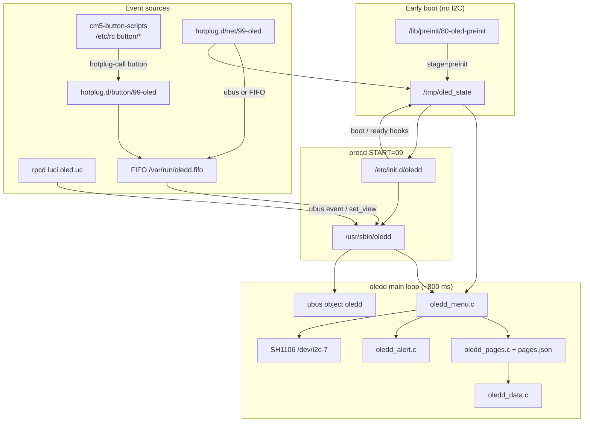

# oledd lifecycle, events, and integration

*Last updated: 2026-06-25.*

Reference for the **`oledd`** menu daemon shipped in [`luci-app-oled`](../feeds/luci/luci-app-oled/) on Orange Pi CM5 Base ImmortalWrt images. Covers boot stages, screen modes, FIFO/ubus events, state files, `pages.json`, alerts, LuCI RPC, and CM5 button wiring.

**Related docs:**

- [CM5 + Waveshare 1.3" OLED HAT wiring](cm5-waveshare-oled-hat-wiring.md) — FPC harness, RST, I2C7
- [OLED menu design](oled-menu.md) — original goals and phase plan
- [OLED menu implementation](oled-menu-implementation.md) — file layout and build notes (some details superseded here)

**Package paths (on router):**

| Path | Role |
|------|------|
| `/usr/sbin/oledd` | Menu daemon (SH1106 128×64, userspace I2C) |
| `/usr/bin/oled` | Legacy screensaver (`menu_mode=0`) |
| `/etc/init.d/oledd` | procd service (`START=09`, `USE_PROCD=1`) |
| `/etc/config/oled` | UCI — enable, I2C path, menu options |
| `/etc/oled/pages.json` | Dashboard page definitions |
| `/usr/lib/oled/*.sh` | Boot state, FIFO helper, CM5 defaults |
| `/lib/preinit/80-oled-preinit` | Earliest boot stage marker (no I2C) |

---

## 1. Architecture overview

`oledd` is a single-process C daemon. It owns the SH1106 framebuffer, polls input and metrics on a fixed interval, and renders one of several screen modes. External scripts never draw to the panel directly after preinit — they update state files or push typed events.



**Module map (`src/oledd/`):**

| File | Responsibility |
|------|----------------|
| `oledd.c` | Main loop, I2C init, ubus client/server wiring, poll interval |
| `oledd_menu.c` | Screen mode FSM, boot splash, legacy views, auto-rotate |
| `oledd_pages.c` | Load/render `pages.json` elements |
| `oledd_data.c` | Live token substitution (ubus, `/sys`, shell helpers) |
| `oledd_input.c` | FIFO reader + ubus `event` push queue |
| `oledd_alert.c` | WAN-down / high-load banner overlay |
| `oledd_config.c` | Read `/etc/config/oled` menu options |
| `oledd_ubus.c` | libubus client (`system`, `network.*`, WiFi) |
| `oledd_ubus_srv.c` | libubus server object `oledd` |
| `oledd_net.c` | Port list + sysfs bandwidth rates |
| `oledd_wifi_ap.c` | AP SSID + WiFi join QR payload |
| `oledd_qrcode.c` | QR rendering for WiFi page |

---

## 2. Boot and load stages

Boot progress is **monotonic**. Stages never regress (e.g. WAN `ifdown` does not rewind `ready` → `network`).

### 2.1 Stage pipeline

| Order | `stage=` value | Typical writer | Progress bar % | Notes |
|------:|----------------|----------------|---------------:|-------|
| 1 | `preinit` | `/lib/preinit/80-oled-preinit` | 10 | **No I2C access** — state file only |
| 2 | `boot` | `/etc/init.d/oledd` start | 35 | Set when daemon starts if not already `network`/`ready` |
| 3 | `network` | `/etc/hotplug.d/net/99-oled` on `ifup`/`ifupdate` | 65 | Also written with `message=ifup eth0` etc. |
| 4 | `ready` | Hotplug (`eth0`/`eth1`/`eth2`/`br-lan` or `lan`/`wan` ifup), `oledd` init if `br-lan` already up, procd `interface.* lan` trigger | 100 | Touches `/tmp/oled_net_changed` (legacy hook) |

**Stage rank** (in `oled-boot-state.sh`): `preinit`(1) &lt; `boot`(2) &lt; `network`(3) &lt; `ready`(4). Lower rank writes are ignored and logged as `oledd-boot: ignore stage regression`.

Optional `message=` line is shown on the boot splash (default `BOOTING...`).

### 2.2 Timeline (typical CM5 boot)

```text
kernel / preinit
  └─ 80-oled-preinit → stage=preinit, message=BOOTING...
procd rcS
  └─ START=09 oledd init
       ├─ wait up to 15 s for /dev/i2c-7
       ├─ oled-boot-state.sh boot "Starting oledd..." (if not network/ready)
       └─ if br-lan operstate up|unknown → ready "LAN up"
  └─ procd spawns /usr/sbin/oledd
oledd main
  ├─ I2C init (up to 15 × 500 ms retries) + SH1106 sequence
  ├─ On-panel "BOOTING..." splash
  ├─ oledd_pages_load(/etc/oled/pages.json) — or legacy fallback
  ├─ SCREEN_BOOT until boot completes
  └─ leave_boot() → SCREEN_PAGES (or SCREEN_LEGACY)
net hotplug (parallel)
  └─ 99-oled: network on ifup; ready when LAN/WAN devices or logical interfaces up
```

### 2.3 `oledd` start sequence (daemon)

From `oledd.c` after procd exec:

1. Parse CLI: `--i2cDevPath`, `--rotate`, `--poll-ms` (default **800**), `--view-timeout`, `--idle-dim-sec`.
2. Read UCI via `oledd_config.c`: `menu_wifi`, `menu_interactive`, `menu_alerts`, button names, `menu_pages` path.
3. `init_display()` — I2C + SH1106 + first `BOOTING...` frame.
4. `oledd_menu_init()` — load `pages.json`; if `/tmp/oled_state` stage is already `network` or `ready`, skip boot splash immediately.
5. `oledd_ubus_open()` + register `oledd` object (retries in loop if ubus late).
6. `oledd_input_init()` — open FIFO.
7. `oledd_alert_init()`.
8. **Main loop** (until SIGTERM): ubus poll → input poll → alert poll → `oledd_menu_tick()` → idle dim check → `oledd_menu_render()` → `usleep(poll_ms)`.

procd respawn: `3600 5 0` (throttled restarts).

### 2.4 Leaving the boot splash

`boot_active()` in `oledd_menu.c` returns **false** (boot done) when `stage` is `network` or `ready`. Missing `/tmp/oled_state` means **still booting**.

Exit boot splash (`leave_boot()`) when:

| Condition | Behaviour |
|-----------|-----------|
| `stage` is `network` or `ready` | Auto-advance to pages or legacy views |
| **20 s** elapsed since boot screen started (`BOOT_TIMEOUT_SEC`) | Log warning, force `leave_boot()` |
| Any FIFO/ubus event during boot | Immediate `leave_boot()` + handle navigation event |
| `pages.json` loaded | `SCREEN_PAGES`, page index 0 |
| `pages.json` missing/invalid | `SCREEN_LEGACY`, start on System view |

> **Historical note:** Boot splash timeout was **45 s** until package r47; current code uses **20 s**. Auto-rotate view timeout (`menu_timeout`, default **5 s**) is separate and applies only after leaving boot.

### 2.5 `pages.json` load

- Path from UCI `menu_pages` (default `/etc/oled/pages.json`).
- Parsed at `oledd_menu_init()` via `blobmsg_add_json_from_file`.
- Requires top-level `"pages"` array; up to **8** pages, **24** elements each.
- Pages with `"enabled": false` are skipped.
- Failure logs `OLED pages config failed` and falls back to **legacy** System / Ports / WiFi rotation.

---

## 3. Screen modes

Three internal modes (`enum screen_mode` in `oledd_menu.c`):

| Mode | `oledd_menu_view_name()` | Description |
|------|--------------------------|-------------|
| `SCREEN_BOOT` | `boot` | Splash: message, progress bar, stage label |
| `SCREEN_PAGES` | page `id` from JSON | Config-driven dashboard (`status`, `network`, …) |
| `SCREEN_LEGACY` | `system` \| `ports` \| `wifi` | Built-in views when JSON unavailable |

### 3.1 Auto-rotate vs interactive

Controlled by UCI `menu_interactive` (default **`0`** = auto-rotate).

| Setting | Navigation | Timeout behaviour | Idle blanking |
|---------|------------|-------------------|---------------|
| `menu_interactive=0` | Pages advance automatically every `menu_timeout` s (default 5) | `menu_timeout` → `--view-timeout` | **Disabled** in auto-rotate (r41) |
| `menu_interactive=1` | Buttons / FIFO / LuCI only | No auto page advance | Optional `menu_idle_dim` s → blank framebuffer until input |

Physical buttons always work; in auto-rotate they skip boot splash and change page immediately.

Legacy mode (`SCREEN_LEGACY`) rotates `system` → `ports` → `wifi` (if `menu_wifi=1`) when auto-rotate is on.

### 3.2 Idle dim (interactive only)

When `menu_idle_dim` &gt; 0 and `menu_interactive=1`, display clears after N seconds without activity. `oledd_menu_wake()` on any event or `set_view`. Syslog: `idle dim after Ns (view=…)`.

---

## 4. Event types

### 4.1 `OLEDD_EV_*` (internal enum)

Defined in `oledd_input.h`:

| Enum | FIFO / ubus `type` string | Aliases | Menu action (pages mode) |
|------|---------------------------|---------|--------------------------|
| `OLEDD_EV_NONE` | — | — | — |
| `OLEDD_EV_NET` | `net` | — | Jump to page `id=network` if present |
| `OLEDD_EV_UP` | `up` | `prev` | Previous page |
| `OLEDD_EV_DOWN` | `down` | — | Next page |
| `OLEDD_EV_OK` | `ok` | — | Next page (same as down) |
| `OLEDD_EV_BACK` | `back` | — | Previous page |
| `OLEDD_EV_NEXT` | `next` | — | Next page |
| `OLEDD_EV_REFRESH` | `refresh` | — | No-op (next render cycle redraws) |

During **`SCREEN_BOOT`**, any non-`NONE` event ends the splash and applies the navigation action.

### 4.2 FIFO paths

| Path | Notes |
|------|-------|
| `/var/run/oledd.fifo` | Primary; created by `oledd_input_init()` (`mkfifo`, mode 0600) |
| `/tmp/oledd.fifo` | Fallback if `/var/run` unavailable |

**Writers:**

- `/usr/lib/oled/oledd-event.sh <type>` — used by hotplug and shell
- `ubus call oledd event '{"type":"next"}'` — preferred by net hotplug; pushes via `oledd_input_push()` (bypasses FIFO read race)

**Event log:** `/tmp/oledd_events.log` — append-only audit of each line received.

### 4.3 Hotplug: buttons

`/etc/hotplug.d/button/99-oled` (invoked via `cm5-button-scripts` → `oled-forward` → `hotplug-call button`):

- Only `ACTION=pressed` is handled.
- UCI `menu_select_button` (default **`wps`** / USERKEY) → `oledd-event.sh next`
- UCI `menu_nav_button` (default **`BTN_2`** / MaskROM) → `oledd-event.sh prev`
- `menu_select_button=none` disables select mapping.

**cm5-button-scripts chain:**

```text
/etc/rc.button/wps or BTN_2
  → /usr/share/cm5-button-scripts/oled-forward
  → /sbin/hotplug-call button
  → /etc/hotplug.d/button/99-oled
  → oledd-event.sh
```

WPS handler also triggers `hostapd_cli wps_pbc` on press (independent of OLED).

### 4.4 Hotplug: network

`/etc/hotplug.d/net/99-oled`:

| `ACTION` | Boot state | oledd notify |
|----------|------------|--------------|
| `ifup`, `ifupdate` | `network` then `ready` for `eth0`–`eth2`, `br-lan`, or `lan`/`wan` interface | `ubus call oledd event '{"type":"net"}'` or FIFO `net` |
| `ifdown` | **No** state change | `net` event only (refresh port data) |

---

## 5. State files

| File | Format | Writer | Reader |
|------|--------|--------|--------|
| `/tmp/oled_state` | `stage=<name>` optional `message=<text>` | `oled-boot-state.sh`, preinit, init, hotplug | `oledd_menu.c`, `oledd_ubus_srv.c`, LuCI |
| `/var/run/oledd.fifo` | Single-line event types | `oledd` creates; scripts write | `oledd_input.c` |
| `/tmp/oledd.fifo` | FIFO fallback | same | same |
| `/tmp/oledd_events.log` | One event per line | `oledd_input.c` | debug, `cm5-oled-debug.sh` |
| `/tmp/oled_net_changed` | Empty touch file | `oled-boot-state.sh` on `ready` | *(no reader in current oledd C code)* |

Example `/tmp/oled_state`:

```text
stage=ready
message=LAN up
```

---

## 6. ubus API (`oledd` object)

Registered when `oledd` runs (`oledd_ubus_srv.c`). Polled each main-loop iteration via `uloop_run_timeout(10)`.

### `status` (no args)

```json
{
  "running": true,
  "view": "status",
  "boot_stage": "ready",
  "i2c": "/dev/i2c-7",
  "menu_interactive": false,
  "dimmed": false
}
```

- `view` — current page id, `boot`, or legacy name (`system`, `ports`, `wifi`).
- `boot_stage` — from `/tmp/oled_state` (`stage=` line).

### `event` — `{"type": "<string>"}`

Valid types: `net`, `up`, `down`, `prev`, `ok`, `back`, `next`, `refresh`.

Returns `{"ok": true}` or `UBUS_STATUS_INVALID_ARGUMENT`.

### `set_view` — `{"view": "<id>"}`

Accepted views:

- `boot` — return to boot splash
- Any `pages.json` page `id` (`status`, `network`, `clients`, …)
- Legacy: `system`, `ports`, `wifi` (if `menu_wifi`)

Returns `{"ok": true}` on success.

**CLI examples:**

```sh
ubus call oledd status
ubus call oledd event '{"type":"next"}'
ubus call oledd set_view '{"view":"network"}'
```

---

## 7. `pages.json` schema

Default ship file: `/etc/oled/pages.json` (128×64, six pages).

### 7.1 Page object

| Field | Type | Description |
|-------|------|-------------|
| `id` | string | Unique id; used by `set_view` and `OLEDD_EV_NET` |
| `title` | string | Display title (LuCI preview) |
| `tabIcon` | string | Icon name for LuCI tab list |
| `enabled` | bool | `false` skips page |
| `elements` | array | Draw primitives |

### 7.2 Element types

| `type` | Key fields | Notes |
|--------|------------|-------|
| `text` | `x`, `y`, `text`, `font`, `align`, `invert` | `{token}` substitution |
| `rect` | `x`, `y`, `w`, `h`, `fill` | Filled or outline |
| `line` | `x1`, `y1`, `x2`, `y2` | |
| `bar` | `x`, `y`, `w`, `h`, `value` | `value` as `0.0–1.0` or `{token}` |
| `icon` | `x`, `y`, `name`, `size` | See icon table below |
| `sparkline` | `x`, `y`, `w`, `h`, `data` | `"data": "ping"` uses live ping history |
| `qrcode` | `x`, `y`, `size`, `source` | `"source": "wifi_ap"` for join QR |

**Fonts:** `xs` (default), `sm`/`md`, `lg`/`xl`/`huge`.

**Align:** `left` (default), `right`, `center`.

### 7.3 Page indicator

Rendered by `oledd_pages_draw_indicator()` at **y = 61**: filled circle = current page, hollow = others (hidden if only one page).

### 7.4 Data tokens

String tokens in `{braces}` in `text` or bar `value`:

| Token | Source | Notes |
|-------|--------|-------|
| `time` | `localtime()` | `HH:MM` |
| `cpu_temp` | `/sys` hwmon/thermal | `NC` or `45C` |
| `temp_short` | same | `C` only |
| `ram_used` | ubus `system info` | `123M` or `1.2G` |
| `load_short` | ubus load | `0.05` |
| `uptime_short` | ubus uptime | `2d03h` or `3h15m` |
| `wan_ip` | port poll / eth0 | `---` if down |
| `rx_rate`, `tx_rate` | WAN port Mbps | `1.2 Mb` |
| `ping_ms` | gateway ping | rolling sparkline input |
| `clients_total` | WiFi STA count | zero-padded |
| `wifi_24`, `wifi_5` | STA ÷ 2 | **approximation**, not per-band |
| `lan_clients` | DHCP leases | capped display `02` |
| `dhcp_leases` | `/tmp/dhcp.leases` | `n/250` |
| `root_usage`, `data_usage` | `statvfs` | `used/total` string |
| `swap_usage` | stub | `0/2G` |
| `wifi_ssid`, `wifi_ap_state` | `oledd_wifi_ap` | AP from UCI/wireless |
| `wifi_qr` | WiFi AP | QR payload string |
| `firewall_state` | stub | `ACTIVE` |
| `blocked_24h` | stub | `0` |
| `vpn_tunnels` | stub | `0 UP` |

Float tokens for bars (`value`):

| Token | Range |
|-------|-------|
| `cpu_load` | 0.0–1.0 from load1 |
| `ram_pct`, `root_pct`, `data_pct` | 0.0–1.0 |
| `dhcp_pct` | leases / 250 |

### 7.5 Icon names (`oledd_icons.c`)

`cpu`, `ram`, `disk`, `sd`, `wifi`, `signal`, `globe`, `thermo`, `clock`, `power`, `lock`, `up`, `down`, `gear`, `chip`, `router`, `shield` — sizes **8**, **12**, **16**, or **24** where defined.

---

## 8. Alerts

When UCI `menu_alerts=1` (default), `oledd_alert_poll()` each loop:

| Condition | Detection | Banner |
|-----------|-----------|--------|
| **WAN down** (priority) | `eth0` operstate `down` **or** `network.interface.wan` not up | `! WAN down` |
| High load | ubus load1 &gt; **2.0** | `! High load` |

Drawn as inverted bar at **y = 54–63** (`oledd_alert_draw()`), above page indicator dots.

Alerts are suppressed when `menu_alerts=0`.

---

## 9. LuCI integration

**Menu:** *Services → OLED* (`luci-app-oled`).

**rpcd:** `/usr/share/rpcd/ucode/luci.oled.uc`

| RPC method | Purpose |
|------------|---------|
| `getConfig` / `setConfig` | UCI read/write; `setConfig` runs `cm5_oled_sync_service` + optional restart |
| `getStatus` | Daemon running, `view`, boot stage, page index, dimmed, RST sysfs |
| `getPagePreview` | **Preview sync** — mirrors on-panel content: resolves `pages.json` elements with live metrics (or boot message when `view=boot`) |
| `pageControl` | `action=prev\|next` → ubus `event` or FIFO; `action=goto` + `page_id` → `set_view` |
| `detectI2c`, `releaseRst`, `serviceControl`, `getLogs` | Diagnostics and service management |

Preview uses the same token rules as `oledd_data.c` (via `collect_oled_metrics()`). RX/TX rates in preview may show `0.0 Mb` (not polled in ucode path).

**Config apply path:** `cm5-apply-config.sh` — CM5 defaults, `oled_start_enabled`, ucitrack init.

---

## 10. CM5 button hardware

### 10.1 What works on CM5 Base (default harness)

| Physical control | Kernel `BUTTON` | Default UCI | OLED action |
|------------------|-----------------|-------------|-------------|
| **USERKEY** (front) | `wps` | `menu_select_button=wps` | **Next page** (`next`) |
| **MaskROM** (recovery) | `BTN_2` | `menu_nav_button=BTN_2` | **Previous page** (`prev`) |

Handlers live in **`cm5-button-scripts`** (`/etc/rc.button/wps`, `BTN_2`). They log to `/var/log/button-events.log` and chain to OLED hotplug.

LuCI allows `BTN_2` \| `wps` \| `none` for select; nav is `BTN_2` \| `wps`.

### 10.2 Waveshare HAT keys (not wired)

The CM5 **5-wire FPC harness** connects power, I2C, and RST only. HAT **KEY1 / KEY2 / KEY3** and the joystick are **not** routed to the base board.

To use HAT buttons later: add GPIO lines from FPC pads to HAT pins and new `hotplug.d/button` rules calling `oledd-event.sh up|down|back`.

See [cm5-waveshare-oled-hat-wiring.md § Unused HAT pins](cm5-waveshare-oled-hat-wiring.md).

---

## 11. Troubleshooting

### 11.1 Common log lines (`logread -e oledd`)

| Log | Meaning |
|-----|---------|
| `oledd: starting nav=BTN_2 select=wps interactive=0 …` | Daemon up; check button mapping |
| `loaded N OLED pages from /etc/oled/pages.json` | JSON OK |
| `OLED pages config failed … using legacy views` | Bad/missing JSON |
| `boot complete — page dashboard` | Left boot splash |
| `boot timeout (20s) — leaving splash` | No `ready` within 20 s |
| `oledd-boot: stage=ready LAN up` | Boot state writer |
| `oledd-boot: ignore stage regression` | Blocked backwards stage |
| `I2C init failed on /dev/i2c-7` | Bus/RST/HAT wiring |
| `idle dim after Ns` | Interactive blanking active |
| `ubus object registration failed` | ubus not ready (retries in loop) |

### 11.2 SSH command cheat sheet

```sh
# Full CM5 OLED diagnostic bundle
sh /usr/lib/oled/cm5-oled-debug.sh

# Boot state
cat /tmp/oled_state

# Daemon + ubus
pgrep -af oledd
ubus call oledd status

# Manual navigation
ubus call oledd event '{"type":"next"}'
/usr/lib/oled/oledd-event.sh prev

# Force boot stage (testing)
/usr/lib/oled/oled-boot-state.sh ready "Manual ready"

# Event history
tail -20 /tmp/oledd_events.log

# Service
/etc/init.d/oledd restart
logread -e 'oledd|oledd-boot|oled-cm5' | tail -40

# I2C sanity (prefer i2cget over i2cdetect on SH1106)
i2cget -y 7 0x3c 0x00 b
echo 1 > /sys/class/leds/waveshare-oled-rst/brightness

# UCI menu flags
uci show oled
```

### 11.3 Symptom → check

| Symptom | Likely cause |
|---------|----------------|
| Stuck on boot splash &gt; 20 s then pages | WAN down, no LAN ifup — timeout escape (r47) |
| Stuck on boot splash indefinitely | Very old firmware (`network` not treated as complete) — upgrade |
| Black screen after boot | `menu_idle_dim` with interactive mode; press button or disable |
| Buttons no effect | `cm5-button-scripts` missing; wrong UCI mapping; `oledd` not running |
| `pages.json` ignored | Parse error — `logread \| grep pages` |
| Blank QR on WiFi page | No active AP — `wifi_ap_state` = `NO AP` |
| Legacy views instead of dashboard | JSON load failed or empty `pages` array |

---

## Appendix: UCI options (`menu_mode=1`)

| Option | Default (CM5) | Maps to |
|--------|---------------|---------|
| `enable` | `1` | Service enabled |
| `menu_mode` | `1` | `1` = `oledd`, `0` = legacy `oled` |
| `path` | `/dev/i2c-7` | `--i2cDevPath` |
| `rotate` | `0` | `--rotate` |
| `menu_timeout` | `5` | `--view-timeout` (auto-rotate seconds per page) |
| `menu_idle_dim` | `0` | `--idle-dim-sec` (interactive blank) |
| `menu_interactive` | `0` | Auto-rotate vs button-driven |
| `menu_wifi` | `1` | Include WiFi in legacy rotation |
| `menu_alerts` | `1` | WAN/load banners |
| `menu_nav_button` | `BTN_2` | Previous page |
| `menu_select_button` | `wps` | Next page |
| `menu_pages` | `/etc/oled/pages.json` | JSON path |

Legacy screensaver options (`date`, `netspeed`, `drawline`, …) apply only when `menu_mode=0`.
