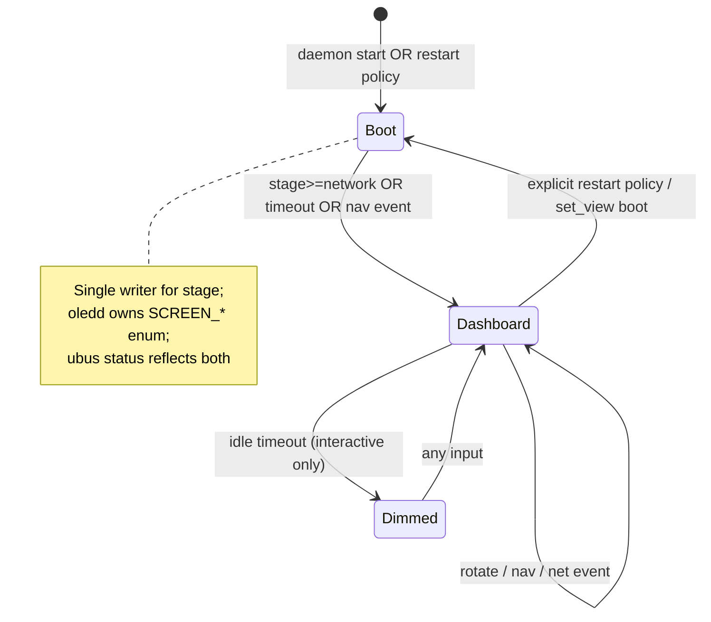

# oledd / luci-app-oled — review and improvement plan

*Generated: 2026-06-25. Package: `luci-app-oled` r49 (`feeds/luci/luci-app-oled/`).*

This document reviews the current **oledd** menu daemon, LuCI front-end, boot/state integration, and CM5 button chain. It maps findings to reported user pain points and proposes a phased fix plan with test coverage notes.

**Related references:**

- [oledd-lifecycle-and-events.md](oledd-lifecycle-and-events.md) — operational reference (mostly accurate for r47+)
- [oled-menu.md](oled-menu.md) — original design goals
- [cm5-waveshare-oled-hat-wiring.md](cm5-waveshare-oled-hat-wiring.md) — hardware harness limits

---

## 1. User requirements cross-reference

| User requirement | Current state | Gap severity |
|------------------|---------------|--------------|
| **Buttons / interactive menu work** | Physical CM5 USERKEY (`wps`) + MaskROM (`BTN_2`) map to `next`/`prev` via hotplug; default `menu_interactive=0` (auto-rotate). HAT KEY1–3/joystick **not wired** on 5-wire FPC. | **P0** — users press HAT buttons or expect WPS-only behavior; FIFO path can block; no per-button action config |
| **No stuck boot stages** | r47 treats `network` as boot-complete; 20s timeout; monotonic `oled-boot-state.sh`. Missing `/tmp/oled_state` still means “booting”. | **P0** — service **restart** skips splash; tmp cleared edge cases; `set_view boot` without state file |
| **Configurable, consistent pages** | `pages.json` drives dashboard; legacy System/Ports/WiFi fallback on parse failure. LuCI cannot edit JSON; UCI has no per-page enable/order. | **P1** |
| **Good UI (LuCI)** | Single-page tabs, live preview, page controls. Preview omits boot progress bar, icons, QR, sparkline; RX/TX hardcoded `0.0 Mb`. | **P1** |
| **WPS + user-defined buttons** | WPS always runs `hostapd_cli wps_pbc` **and** OLED `next` when mapped as select. Only two buttons, fixed `next`/`prev`. | **P0/P1** |
| **Boot / menu / screensaver on every start & restart** | Boot splash tied to `/tmp/oled_state` (survives `oledd` respawn until reboot). **Manual restart** leaves `stage=ready` → no splash. Legacy screensaver (`menu_mode=0`) is a separate binary (`/usr/bin/oled`). | **P0** |

---

## 2. Architecture overview

```text
preinit (80-oled-preinit) → /tmp/oled_state (no I2C)
procd START=09 → init.d/oledd → /usr/sbin/oledd
cm5-button-scripts (/etc/rc.button/*) → oled-forward → hotplug.d/button/99-oled → oledd-event.sh → FIFO
net hotplug 99-oled → oled-boot-state.sh + ubus oledd event net
oledd main loop: ubus poll → FIFO poll → alert → menu_tick → render → sleep(800ms)
```

### 2.1 Strengths

| Area | Detail |
|------|--------|
| **Clear separation** | Display/menu in `oledd`; fan/IR/I2C scan in `luci-app-peripherals`; physical handlers in `cm5-button-scripts`. |
| **Config-driven dashboard** | `pages.json` + token substitution (`oledd_data.c`) avoids recompile for layout tweaks. |
| **Monotonic boot stages** | `oled-boot-state.sh` rank prevents WAN `ifdown` from rewinding `ready`. |
| **Dual event path** | ubus `oledd event` (in-process queue) + FIFO for shell/hotplug; net hotplug prefers ubus. |
| **LuCI modernization** | JS view + `luci.oled.uc` rpcd; preview sync with on-panel tokens. |
| **CM5 defaults** | `uci-defaults`, `cm5-apply-config.sh`, migration `99-oled-cm5-migrate`. |
| **Recent stability fixes** | ubus use-after-free (r26), idle-dim conflation (r41), boot stuck with WAN down (r47). |

### 2.2 Weaknesses

| Area | Detail |
|------|--------|
| **Three parallel “modes”** | `SCREEN_BOOT`, `SCREEN_PAGES`, `SCREEN_LEGACY` — different renderers, headers, and navigation rules. |
| **State split across files** | `/tmp/oled_state` (boot), in-memory FSM (`oledd_menu.c`), UCI (`/etc/config/oled`), `pages.json` — no single source of truth. |
| **Button layer is shell-only** | Hotplug reads UCI at press time; `oledd` logs button names but does not consume them; no ubus fallback in `99-oled`. |
| **FIFO fragility** | `oledd-event.sh` opens FIFO O_WRONLY; blocks if `oledd` not running or reader not yet open. |
| **Restart semantics undefined** | Respawn vs `service restart` vs reboot behave differently for boot splash and `oled_state`. |
| **LuCI / daemon drift** | Preview reimplements tokens in ucode; missing elements; no `pages.json` editor. |
| **Stub metrics** | `firewall_state`, `blocked_24h`, `vpn_tunnels`, `swap_usage` are placeholders in C and ucode. |

---

## 3. Why buttons may not work

### 3.1 Hardware: HAT vs CM5 base (most common confusion)

The CM5 **5-wire FPC harness** carries power, I2C, and RST only. Waveshare HAT **KEY1 / KEY2 / KEY3** and the joystick GPIOs are **not** connected to the base board.

| Control | Kernel name | Default UCI | OLED action |
|---------|-------------|-------------|-------------|
| USERKEY (front) | `wps` | `menu_select_button=wps` | `next` |
| MaskROM (recovery) | `BTN_2` | `menu_nav_button=BTN_2` | `prev` |

Users pressing HAT keys will see **no effect**. LuCI Buttons tab documents this (r47+), but on-device behavior still feels “broken.”

### 3.2 Hotplug chain breaks

Required chain:

```text
/etc/rc.button/wps|BTN_2  (cm5-button-scripts, executable)
  → /usr/share/cm5-button-scripts/oled-forward
  → /sbin/hotplug-call button
  → /etc/hotplug.d/button/99-oled
  → /usr/lib/oled/oledd-event.sh
```

Failure points:

1. **`cm5-button-scripts` not installed** — no `/etc/rc.button/*`, procd never invokes handlers.
2. **`luci-app-oled` hotplug not installed** — forward runs but `99-oled` missing.
3. **`oledd` not running** — FIFO writer may **block** (see §3.4); events lost.
4. **`menu_select_button=none`** — select mapping disabled (nav still works).
5. **Wrong UCI mapping** — both buttons mapped to same role.

`99-oled` only handles `ACTION=pressed`. `oled-forward` is also called on `released`; harmless (early exit).

### 3.3 Boot splash swallowing / delaying button response

During `SCREEN_BOOT`, **any** non-`NONE` event calls `leave_boot()` then applies navigation — buttons should skip splash (r47). If user perception is “buttons don’t work,” causes include:

- Still on splash but **auto-rotate not started** — user expects immediate page change visibility; 800ms poll adds latency.
- **`menu_interactive=0`** (default) — buttons change page but **auto-rotate continues**; change may be overwritten in ≤`menu_timeout` seconds.
- **Idle dim** (`menu_interactive=1`, `menu_idle_dim>0`) — panel blank until next press.

### 3.4 FIFO vs ubus asymmetry

| Writer | Path | Blocks? |
|--------|------|---------|
| `hotplug.d/net/99-oled` | ubus first, FIFO fallback | ubus: no |
| `hotplug.d/button/99-oled` | FIFO only via `oledd-event.sh` | **Yes** if no reader |
| `luci.oled.uc` `pageControl` | ubus first, FIFO fallback | ubus: no |

Button path lacks ubus-first — **P0 fix**.

`oledd_input.c` reads one FIFO buffer per poll; multiple rapid presses may coalesce. ubus `oledd_input_push()` uses a **single** `g_pending` slot — last event wins if poll interval missed.

### 3.5 WPS coupling

`/etc/rc.button/wps` always starts `hostapd_cli wps_pbc` on press, then chains OLED. Users cannot assign WPS to OLED-only or WPS-only without editing `cm5-button-scripts`.

---

## 4. Stage machine bugs and edge cases

### 4.1 Boot FSM (`oledd_menu.c`)

```c
boot_active() → false when stage is "network" or "ready"
             → true when state file missing or stage is preinit/boot
```

| Scenario | Behavior | Issue |
|----------|----------|-------|
| Normal boot | preinit → boot → network → ready | OK |
| WAN down, LAN up | `ready` via br-lan/eth1/eth2 | Fixed r47 |
| 20s no ready/network | `leave_boot()` forced | OK |
| **Service restart** | `oled_state` still `ready` | **No boot splash** — user requirement unmet |
| **oledd respawn** (crash) | state usually still `ready` | Skips splash (intentional for r47) |
| **`/tmp` cleared** (rare) | missing state = booting forever until timeout/button | Acceptable but confusing |
| **`set_view boot`** (ubus/LuCI) | Returns to `SCREEN_BOOT` | Does **not** reset `oled_state`; `boot_active()` may be false → immediate `leave_boot()` on next tick |

### 4.2 `oled_state` writers vs readers

| Writer | When |
|--------|------|
| `80-oled-preinit` | Earliest boot |
| `init.d/oledd` | `boot` if not network/ready; `ready` if br-lan up |
| `hotplug.d/net/99-oled` | `network` on ifup; `ready` on LAN devices |
| procd `interface.* lan` trigger | `ready` |

**Gap:** No writer sets `boot` on **`/etc/init.d/oledd restart`** when state is already `ready`.

### 4.3 Respawn regression (historical + residual)

| Issue | Status |
|-------|--------|
| ubus use-after-free crash loop | Fixed r26 |
| SH1106 `exit(1)` on I2C glitch | Fixed r25 |
| Missing state skipped boot | Fixed r25 (now treats missing as booting) |
| Idle dim after splash | Fixed r41 |
| Stuck splash WAN down | Fixed r47 |
| **Restart should show boot** | **Open** |
| **Crash mid-boot then respawn** | May show splash up to 20s if state stuck at `boot` | Acceptable |

`procd_set_param respawn 3600 5 0` — throttled restarts; does not reset `oled_state`.

### 4.4 `/tmp/oled_net_changed`

Touched on `ready` in `oled-boot-state.sh` but **no reader** in current `oledd` C code — dead hook from Phase 1.

---

## 5. pages.json vs legacy inconsistency

| Aspect | `SCREEN_PAGES` (`pages.json`) | `SCREEN_LEGACY` |
|--------|------------------------------|-----------------|
| Trigger | JSON load success | JSON missing/invalid/empty |
| Layout | Per-element JSON (rect headers, icons, bars) | Hardcoded `draw_header()` + line at y=10 |
| Views | 6 pages: status, network, clients, storage, wifi, security | 3 views: system, ports, wifi |
| WiFi | QR page + AP tokens | Simple SSID/clients/channel |
| Network | Tokenized WAN + sparkline | Port list with rate bars |
| Page indicator | Dots at y=61 | None |
| Navigation | `OLEDD_EV_NET` → page id `network` | → `LEGACY_PORTS` |

**User impact:** After JSON parse failure, dashboard “feels like a different product.” Logs show `OLED pages config failed — using legacy views`.

**LuCI:** Preview always uses `pages.json`; if daemon is in legacy mode, preview **does not match** panel.

---

## 6. LuCI preview gaps

Implementation: `luci.oled.uc` `getPagePreview` + `oled.js` canvas/SVG renderer.

| On-panel feature | In preview |
|------------------|------------|
| Boot progress bar + stage label | Message text only |
| Icons (`oledd_icons.c`) | Not rendered |
| QR code | Not rendered |
| Sparkline (`data: ping`) | Not rendered |
| Page indicator dots | Not rendered |
| Alert banner (WAN down / high load) | Not shown |
| RX/TX rates | Hardcoded `0.0 Mb` in `collect_oled_metrics()` |
| Legacy views (`system`/`ports`/`wifi`) | Empty/minimal if view not in JSON |
| Dimmed (idle blank) | Status flag only, not black preview |

`pageControl` correctly prefers ubus — good reference for button hotplug fix.

---

## 7. Configurability gaps

### 7.1 UCI (`/etc/config/oled`)

| Option | Used by | Notes |
|--------|---------|-------|
| `menu_mode` | init | `0` = legacy `oled` screensaver, `1` = `oledd` |
| `menu_interactive` | oledd | `0` auto-rotate (CM5 default) |
| `menu_timeout` | oledd CLI | Seconds per page |
| `menu_idle_dim` | oledd CLI | Interactive blank only |
| `menu_nav_button` / `menu_select_button` | **hotplug only** | `BTN_2` \| `wps` \| `none` (select) |
| `menu_pages` | oledd | Path to JSON |
| `menu_wifi` / `menu_alerts` | oledd | Legacy WiFi rotation + alert overlay |
| Legacy draw/date/netspeed/… | **`/usr/bin/oled` only** | Confusing in LuCI Screensaver tab |

**Missing:**

- Per-button **action** map (next/prev/back/WPS/none/custom)
- Per-page enable/order in UCI (only JSON `enabled`)
- `menu_show_boot_on_restart` or equivalent
- Reload `pages.json` without full daemon restart
- HAT GPIO button definitions (future)

### 7.2 pages.json

Shipped at `/etc/oled/pages.json` (conffile). Editable via SSH/scp only. No schema validation in LuCI. Max 8 pages × 24 elements enforced in C.

### 7.3 Interactive mode

`menu_interactive=0`: buttons work for navigation but **auto-rotate always runs** — feels non-interactive. `menu_interactive=1`: auto-rotate off; optional idle dim. No “interactive list/detail” UI described in early design docs — only page carousel.

---

## 8. Screensaver vs boot splash confusion

| Concept | Implementation | When active |
|---------|----------------|-------------|
| **Boot splash** | `oledd` `SCREEN_BOOT` + `/tmp/oled_state` | `menu_mode=1`, until network/ready/timeout/event |
| **Menu / dashboard** | `oledd` `SCREEN_PAGES` or auto-rotate | After boot |
| **Idle blank** | `g_dimmed` clear framebuffer | `menu_interactive=1` + `menu_idle_dim>0` |
| **Legacy screensaver** | `/usr/bin/oled` + `init.d/oled` | `menu_mode=0` |

LuCI still exposes a **Screensaver** tab with draw-line/date/netspeed flags that **do not affect oledd** when `menu_mode=1` (CM5 default). Users conflate “screen went black” (idle dim) with “screensaver” or “stuck boot.”

`cm5_apply_oled_config()` forces `menu_mode=1` and disables legacy flags — good for CM5 images, but preserved UCI from upgrade can re-enable legacy flags until migration runs.

---

## 9. Improvement plan (phased)

### P0 — Reliability and user-visible correctness (target: next package release)

| ID | Task | Files / notes |
|----|------|----------------|
| P0-1 | **Button hotplug: ubus-first** — mirror `99-oled` net pattern in `hotplug.d/button/99-oled` | `root/etc/hotplug.d/button/99-oled` |
| P0-2 | **Non-blocking FIFO write** — `oledd-event.sh` use `timeout 1` or named pipe O_NONBLOCK via helper C/snippet; or drop FIFO when ubus works | `root/usr/lib/oled/oledd-event.sh` |
| P0-3 | **Boot splash on service restart** — `init.d/oledd` `start_service` call `oled-boot-state.sh boot` when procd (re)starts instance; optional UCI `menu_boot_on_restart` | `root/etc/init.d/oledd`, `oled-boot-state.sh` |
| P0-4 | **`set_view boot` coherence** — reset or synthesize `oled_state` stage `boot` when entering boot view; or decouple splash from state file | `oledd_menu.c`, `oledd_ubus_srv.c` |
| P0-5 | **Document + diagnose defaults** — `cm5-oled-debug.sh` check hotplug chain, FIFO, last events; LuCI status: “last button event” from `/tmp/oledd_events.log` | debug script, `luci.oled.uc`, `oled.js` |
| P0-6 | **WPS decouple option** — UCI `menu_wps_hostapd` (default 1) or move WPS PBC to hotplug only when action includes WPS | `cm5-button-scripts`, `99-oled` |

### P1 — Consistency and configurability

| ID | Task |
|----|------|
| P1-1 | **Unified renderer** — single draw path for pages; retire or generate legacy views from JSON |
| P1-2 | **UCI button action map** — e.g. `option menu_btn_wps_action 'next'`, extensible list |
| P1-3 | **LuCI pages editor** — validate JSON, enable/disable pages, reorder; RPC write `pages.json` + SIGHUP/reload |
| P1-4 | **Preview parity** — render icons, bars, boot bar, alerts; poll RX/TX like `oledd_net.c` |
| P1-5 | **Reload pages.json** — ubus `reload` or inotify without full restart |
| P1-6 | **Rename LuCI “Screensaver”** → “Legacy display (oled)” when `menu_mode=1`; hide or collapse section |
| P1-7 | **Real security tokens** — wire `firewall_state`, banIP/blocky counts when packages present |

### P2 — Hardware and polish

| ID | Task |
|----|------|
| P2-1 | **Waveshare HAT GPIO keys** — DTS + `hotplug.d/button` for KEY1–3 via extra FPC wires |
| P2-2 | **Screensaver as oledd mode** — optional clock/date idle screen instead of blank dim |
| P2-3 | **CM5 port list in UCI** — don’t hardcode `eth0`–`eth2` in `oledd.c` |
| P2-4 | **i18n cleanup** — po files still mention old screensaver marketing text |

---

## 10. Unified state machine (target design)



**Rules:**

1. **Never stuck:** always leave Boot via timeout (20s max), stage, or input.
2. **Restart policy:** configurable boot splash on `service restart` independent of `/tmp` persistence.
3. **One renderer:** `pages.json` for all post-boot content; legacy code path removed after migration period.
4. **Events:** ubus primary; FIFO best-effort non-blocking.

---

## 11. Unit and integration tests

Tests live under `feeds/luci/luci-app-oled/tests/`. Run on developer host (no OpenWrt SDK required for these).

| Test file | What it covers |
|-----------|----------------|
| `tests/test-oled-boot-state.sh` | Monotonic stage ranks via patched state path |
| `tests/test_oledd_logic.c` | Event parse, `boot_active` logic, token substitution (mirrored pure functions) |
| `tests/oled-helpers.test.mjs` | `optionSelected`, `disableIf`, ucode-style `subst_tokens` |

### 11.1 What cannot be unit-tested on host

| Area | Reason |
|------|--------|
| SH1106 I2C draw | Needs `/dev/i2c-*` hardware and kernel driver |
| Full `oledd_pages_load` | Requires OpenWrt `libubox` / `blobmsg_json` linked |
| ubus RPC integration | Needs running `ubus` + `oledd` on router |
| procd / hotplug end-to-end | Needs OpenWrt runtime and GPIO button events |
| `hostapd_cli wps_pbc` | Needs WiFi AP stack |
| Font/icon pixel exactness | Bitmap output — snapshot tests possible but not in scope |

### 11.2 Running tests

```sh
cd feeds/luci/luci-app-oled/tests
./run-tests.sh
```

---

## 12. Top 5 recommended P0 fixes (summary)

1. **ubus-first button events** in `hotplug.d/button/99-oled` (match net hotplug).
2. **Non-blocking / timeout FIFO writes** in `oledd-event.sh` so button handlers never hang when `oledd` is down.
3. **Boot splash on `oledd` service restart** — reset boot stage (or dedicated FSM flag) so “every start” includes splash per user expectation.
4. **Fix `set_view boot` vs `oled_state` mismatch** — entering boot view must not instantly exit on next tick.
5. **Surface diagnostics in LuCI** — last FIFO/ubus events, hotplug chain presence, and prominent note that **HAT buttons are not wired** on CM5 default harness.

---

## Appendix A — Key file map

| Path | Role |
|------|------|
| `src/oledd/oledd.c` | Main loop, I2C init |
| `src/oledd/oledd_menu.c` | Screen FSM, boot splash, navigation |
| `src/oledd/oledd_pages.c` | JSON load/render |
| `src/oledd/oledd_input.c` | FIFO + push queue |
| `src/oledd/oledd_ubus_srv.c` | ubus `oledd` object |
| `root/etc/init.d/oledd` | procd service |
| `root/usr/lib/oled/oled-boot-state.sh` | Monotonic boot stages |
| `root/etc/hotplug.d/button/99-oled` | Button → events |
| `root/etc/hotplug.d/net/99-oled` | Net → stage + events |
| `feeds/packages/cm5-button-scripts/files/*` | rc.button + oled-forward |
| `htdocs/.../oled.js` | LuCI UI |
| `root/usr/share/rpcd/ucode/luci.oled.uc` | RPC + preview |

---

## Appendix B — Suggested verification checklist (on CM5 hardware)

1. `logread -e oledd | tail -30` — pages loaded, boot complete, button mapping log line.
2. `cat /tmp/oled_state` — stage progression through boot.
3. `tail -5 /tmp/oledd_events.log` — events on USERKEY/MaskROM press.
4. `ubus call oledd event '{"type":"next"}'` — manual nav works.
5. Press **base board** USERKEY/MaskROM (not HAT keys).
6. `/etc/init.d/oledd restart` — confirm desired boot splash behavior after P0-3.
7. LuCI preview vs photo of panel — note known gaps until P1-4.
